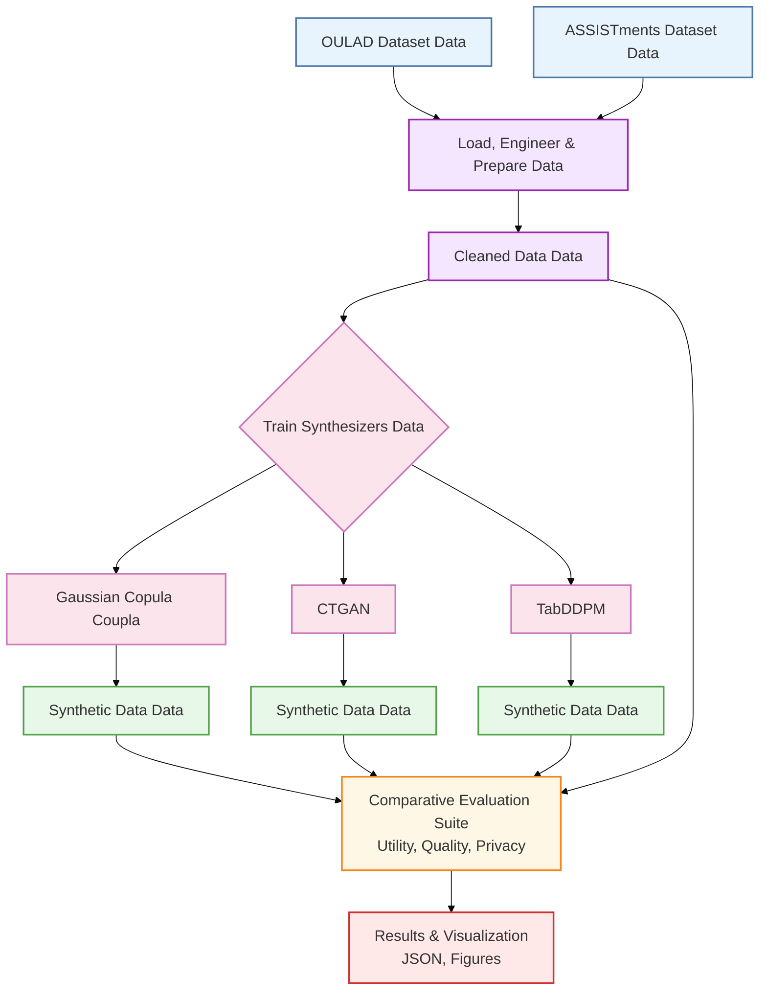

# SYNTHLA-EDU V2 Pipeline Architecture

## Pipeline Description

### Phase 1: Data Preparation
1. **Data Loading**: OULAD (7 CSV files merged) and ASSISTments (interaction logs)
2. **Feature Engineering**: 
   - OULAD: VLE activity aggregation, assessment scoring, registration timing
   - ASSISTments: Student-level aggregation from interaction logs
3. **Target Definition**: Dual-target design for comprehensive utility evaluation
   - Classification: Dropout prediction (OULAD), engagement prediction (ASSISTments)
   - Regression: Weighted score (OULAD), percent correct (ASSISTments)

### Phase 2: Synthetic Data Generation
- **Train/Test Split**: 70/30 stratified, group-aware for OULAD (prevents data leakage)
- **Three Synthesizers**:
  - **Gaussian Copula**: Fast parametric baseline
  - **CTGAN**: GAN-based (300 epochs full, 100 quick)
  - **TabDDPM**: State-of-art diffusion model (1200 iterations full, 300 quick)

### Phase 3: Multi-Dimensional Evaluation
1. **Quality**: SDMetrics overall score (column shapes, correlations)
2. **Utility**: TSTR/TRTR with Random Forest & Logistic Regression (AUC, MAE)
3. **Realism**: C2ST with ID column exclusion (effective AUC [0.5, 1.0])
4. **Privacy**: Multi-attacker MIA (LR, RF, XGBoost; worst-case effective AUC)

### Phase 4: Statistical Rigor
- **Bootstrap CI**: 1,000 resamples, 95% intervals (500 for n < 50)
- **Paired Permutation Tests**: 10,000 permutations for pairwise model comparison
- **Bonferroni Correction**: α = 0.05/18 for family-wise error rate (FWER) control
- **Effect Size**: Cohen's d for practical significance assessment

### Phase 5: Publication Outputs
- **11 Cross-Dataset Figures**: 300 DPI, colorblind-friendly palette
- **Consolidated Results**: Per-dataset JSON with all metrics and statistical tests
- **Execution Logs**: Complete reproducibility trace with timestamps

### Key Design Principles
✅ **No data leakage**: Group-aware splits, ID/target exclusion in C2ST  
✅ **Statistical rigor**: Bootstrap CI, permutation tests, multiple testing correction  
✅ **Reproducibility**: Fixed seeds, locked requirements, execution logs  
✅ **Transparency**: Per-sample losses, effect sizes, comprehensive documentation  
✅ **Publication-ready**: High-resolution figures, professional styling, clear legends
